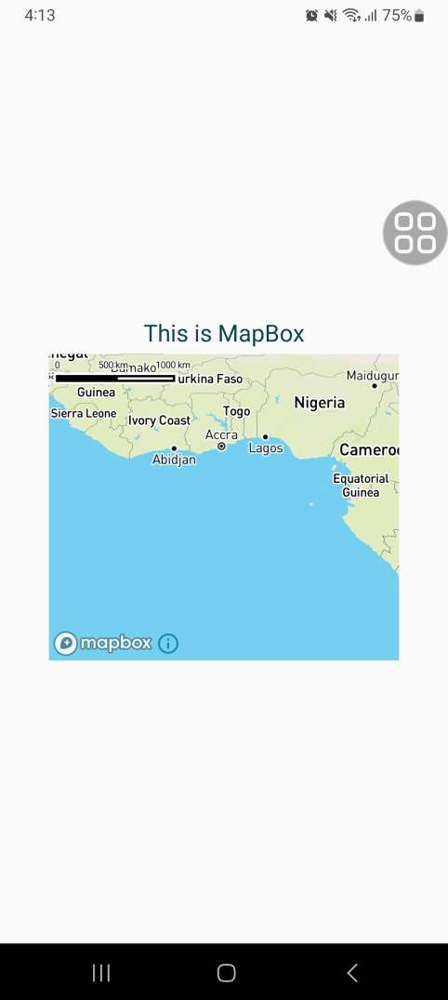

<h1>Run Program</h1>
    <ul>
        <li>Open the program file and enter into MapBoxApp folder.</li>  
        <li>Open terminal and run the following command.</li>
        <li>expo install</li>
        <li>And run the program with this command.</li>  
        <li>If your device does not have eas, install that first with the following command.</li>
        <li>npm install -g eas-cli</li>
        <li>eas build:configure</li>
        <li>When prigram ask choose 'All' option. And run next command.</li>
        <li>eas build --profile development --platform android</li>
        <li>Program will ask your expo account information. fill correctly.</li>
        <li>When get QR code, scan it with expo app form your phone and download APK file and install it. </li>
        <Open>Open terminal form you project and it will give you QR code and link, open app with that link</li>
    </ul>

<h1>MapBox Preview Image</h1>

